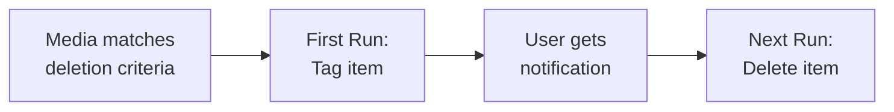

# Leaving Soon

Deleterr's signature feature - a "death row" pattern that gives users time to watch content before it's deleted.

## How It Works

Unlike traditional cleanup tools that delete content immediately, Deleterr implements a two-phase deletion process:



1. **First run**: Items matching deletion criteria are tagged (added to a Plex collection and/or labeled), but **NOT deleted**
2. **Users are notified**: Email, Discord, Slack, or Telegram alerts inform users about expiring content
3. **Subsequent runs**: Previously tagged items are deleted, new candidates are tagged

This gives your users a "warning period" to watch content before it's removed.

## Configuration

### Basic Setup

Add the `leaving_soon` section to your library configuration:

```yaml
libraries:
  - name: "Movies"
    radarr: "Radarr"
    action_mode: "delete"
    max_actions_per_run: 20
    preview_next: 10  # Required for leaving_soon
    leaving_soon:
      collection:
        name: "Leaving Soon"
```

!!! warning "preview_next Required"
    `preview_next` cannot be set to `0` when `leaving_soon` is configured, as the feature needs to tag upcoming deletions.

### Collection Settings

| Property | Type | Default | Description |
|----------|------|---------|-------------|
| `name` | string | - | Name of the Plex collection to create |

### Label Settings

You can also add labels to items instead of (or in addition to) collections:

```yaml
leaving_soon:
  collection:
    name: "Leaving Soon"
  labels:
    name: "leaving-soon"
```

| Property | Type | Default | Description |
|----------|------|---------|-------------|
| `name` | string | - | Label to apply to items scheduled for deletion |

## User Notifications

Configure notifications to alert users about content leaving soon. See [Notifications](notifications.md) for full setup details.

```yaml
notifications:
  leaving_soon:
    subject: "Content leaving your Plex server soon!"
    email:
      smtp_server: "smtp.gmail.com"
      smtp_port: 587
      smtp_username: !env SMTP_USERNAME
      smtp_password: !env SMTP_PASSWORD
      use_tls: true
      from_address: "plex@yourdomain.com"
      to_addresses:
        - "user1@example.com"
        - "user2@example.com"
```

## Example Workflow

Here's what happens during a typical Deleterr run with Leaving Soon enabled:

### Week 1: First Run

1. Deleterr identifies 15 movies matching deletion criteria
2. Movies are added to the "Leaving Soon" collection in Plex
3. Users receive email notification listing the 15 movies
4. **No deletions occur**

### Week 2: Second Run

1. Deleterr identifies the same 15 movies are still tagged
2. Those 15 movies are **deleted** from Radarr
3. New movies matching criteria are tagged for the next cycle
4. Users receive notification about newly tagged items

### User Watches a Movie

If a user watches a movie that's in the "Leaving Soon" collection:

1. The watch history is updated in Tautulli
2. On next run, the movie no longer matches the `last_watched_threshold` criteria
3. The movie is **removed** from the "Leaving Soon" collection
4. The movie survives deletion

## Tips

### Adjust Thresholds for Your Schedule

Match your thresholds to your Deleterr schedule:

| Schedule | Recommended `last_watched_threshold` |
|----------|--------------------------------------|
| Weekly | 90+ days |
| Daily | 14+ days |
| Monthly | 180+ days |

### Use Plex Home Screen

Pin the "Leaving Soon" collection to your Plex home screen so users see it prominently:

1. In Plex, navigate to the "Leaving Soon" collection
2. Click the three dots menu
3. Select "Add to Home"

### Combine with Disk Thresholds

Leaving Soon works well with disk thresholds - items are only tagged when disk space is low:

```yaml
libraries:
  - name: "Movies"
    radarr: "Radarr"
    action_mode: "delete"
    max_actions_per_run: 20
    preview_next: 10
    disk_size_threshold:
      - path: "/data/media"
        threshold: 500GB
    leaving_soon:
      collection:
        name: "Leaving Soon"
```

## Troubleshooting

### Collection Not Appearing in Plex

1. Verify Plex URL and token are correct in your config
2. Check Deleterr logs for Plex API errors
3. Ensure `preview_next` is greater than 0
4. Run with `dry_run: false` - collections are only created in non-dry-run mode

### Items Not Being Deleted

1. Confirm items were tagged in a previous run
2. Check that items still match deletion criteria
3. Verify `action_mode: "delete"` is set
4. Look for exclusion rules that might be protecting the content

### Notifications Not Sending

See [Notifications Troubleshooting](notifications.md#troubleshooting) for notification-specific issues.
